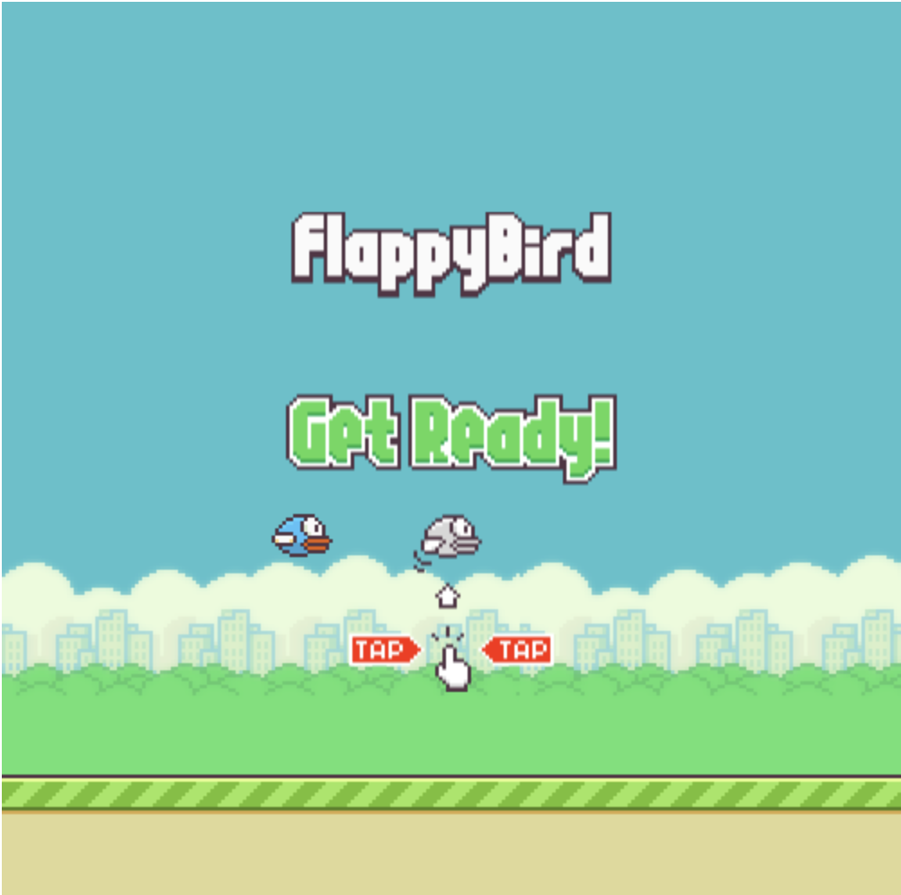

# Flappy Bird in HTML 5 canvas

This repository provides the code for my Flappy bird game, build in HTML 5 canvas. 
The project had as goal to give myself an introduction to game development and to provide an example how a Flappy Bird game could be created.

The game can be played on [flappy.jordyvanraalte.nl](https://flappy.jordyvanraalte.nl)

The game can be run through the Dockerfile, which provides an NGINX websever which serves the index.html. 
With the following command, the Docker image can be build:

````
docker build -t flappy-bird:v1 .
````

And with the following command, the Docker container can be run on the desired port.

````
docker run -d -p 80:80 flappy-bird:v1 .
````

A special thanks to Ylva Tröjbom for recreating some assets and special thanks to [Samuelcust](https://github.com/samuelcust/flappy-bird-assets) providing some Flappy bird assets.
